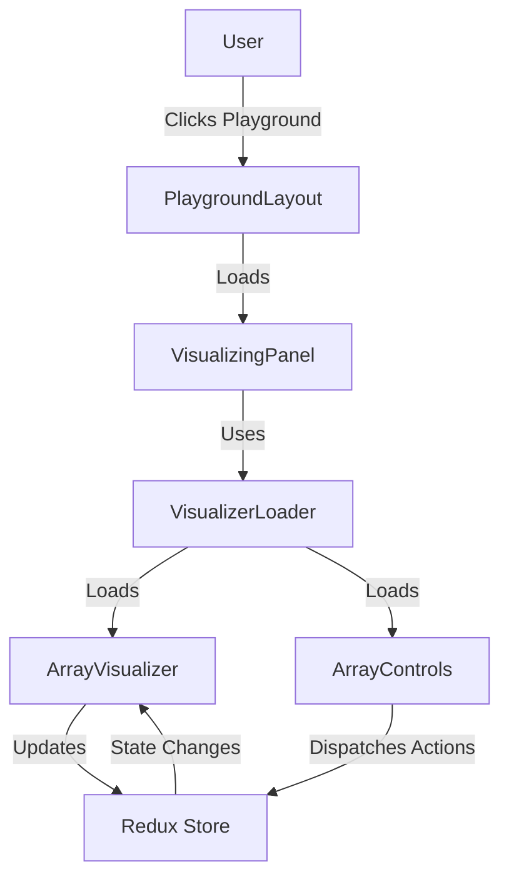
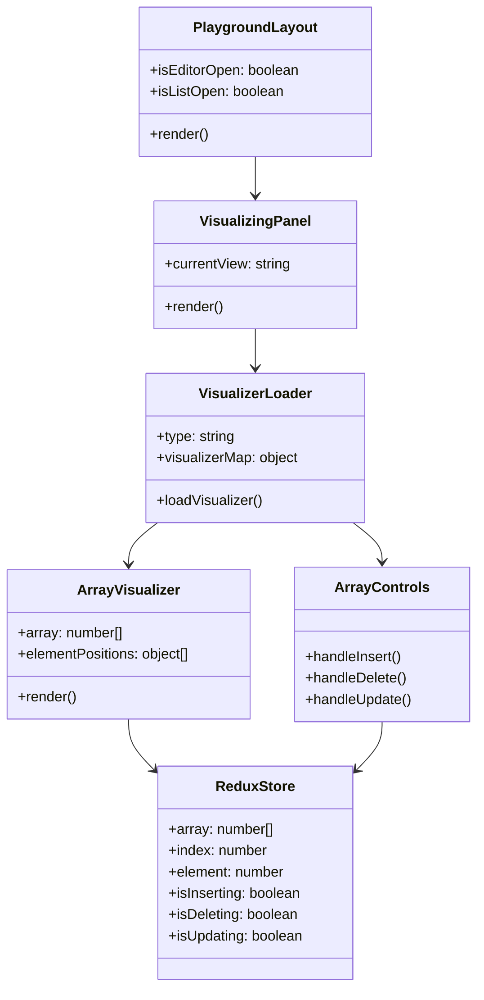
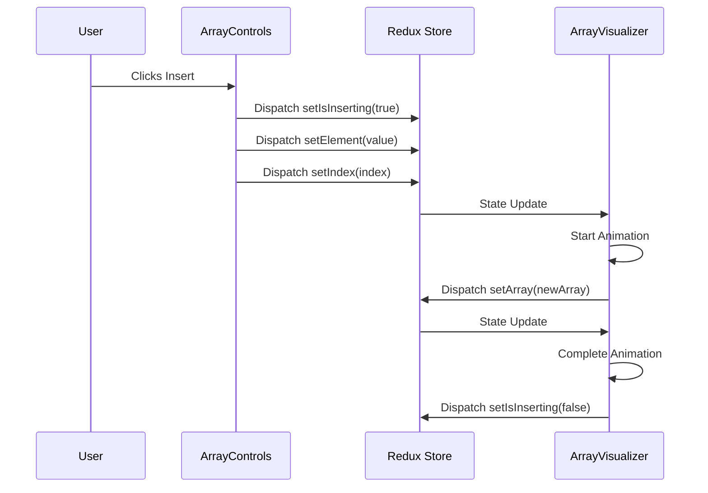
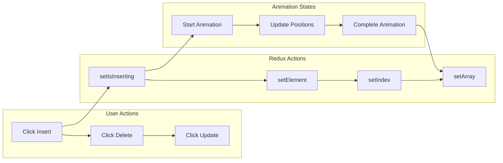
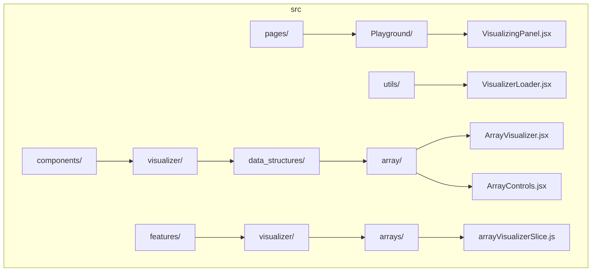
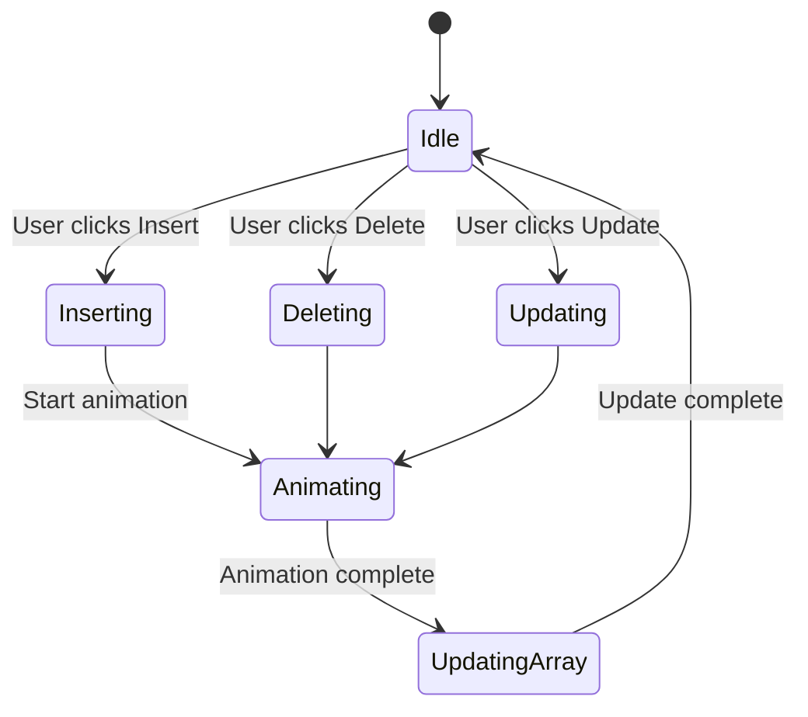

# DS.AlgoDeck

Data Structure and Algorithm Visualizer is an interactive web application designed to help students, developers, and educators learn data structures and algorithms in an engaging way. This tool allows users to explore and manipulate various data structures and algorithms with visual representations. Users can view a real-time visualizer on the left and an interactive code editor on the right, enabling them to write and execute code, view code samples, and observe step-by-step changes in the visualizer.

## 🌟 Current Features

- **Interactive Visualizations**: Real-time visualization of data structures and algorithms
- **Theme Support**: Light and dark mode with customizable themes
- **Responsive Design**: Optimized for various screen sizes with resolution recommendations
- **Algorithm Categories**: Growing collection of common algorithms and data structures
- **Step-by-Step Execution**: Visual representation of algorithm execution steps

## 🚀 Upcoming Features

- **Code Editor Integration**: Monaco editor with syntax highlighting and auto-completion
- **Split-View Interface**: Synchronized visualizer and code editor panels
- **Additional Algorithms**: Regular updates with new algorithms and data structures
- **Enhanced Visualizations**: More interactive and detailed visual representations

> 📢 **Note**: The project is actively under development. New algorithms and visualizations are added regularly. Check back often to explore newly added features and algorithms!

## 🚀 Getting Started

### Prerequisites

- Node.js (v14 or higher)
- npm or yarn package manager

### Installation

1. Clone the repository

```bash
git clone https://github.com/yourusername/ds-algo-deck-v010.git
cd ds-algo-deck-v010
```

2. Install dependencies

```bash
npm install
```

3. Start the development server

```bash
npm run dev
```

## 🎯 Usage

1. **Select a Topic**: Choose from various data structures and algorithms from the left sidebar
2. **View Visualization**: Interact with the visual representation in the main panel
3. **Edit Code**: Modify the implementation in the code editor
4. **Execute**: Run the code and observe the changes in real-time

## 🛠 Technical Stack

- **Frontend**: React.js with Vite
- **State Management**: Redux with Redux Persist
- **UI Components**: NextUI
- **Animations**: Framer Motion
- **Code Editor**: Monaco Editor
- **Styling**: TailwindCSS

## 🏗 Architecture

- **Component-Based Structure**: Modular architecture for maintainability
- **Redux Store**: Centralized state management for app-wide data
- **Responsive Design**: Mobile-first approach with resolution optimization
- **Theme System**: Dynamic theme switching with system preference support

### 🔄 Flow Overview



### 🏗️ Component Architecture



### 🔄 State Management Flow



### 🎯 Array Operations Flow



### 📁 File Structure



### 🎨 Animation States



### 🎨 Visualization Components

- Real-time data structure rendering
- Step-by-step algorithm execution
- Interactive controls for manipulation
- Customizable animation speeds
- State history tracking

## 🔧 Development

### Project Structure

```
src/
  ├── components/     # Reusable UI components
  ├── features/       # Redux slices and features
  ├── pages/          # Route pages
  ├── utils/          # Helper functions
  ├── hooks/          # Custom React hooks
  └── layouts/        # Page layouts
```

## 📱 Resolution Support

The application is optimized for screens with a minimum width of 1576 pixels for the best visualization experience. For smaller screens, the application provides:

- Responsive layout adjustments
- Resolution warning with suggestions
- Zoom level controls

## 🤝 Contributing

Contributions are welcome! Please feel free to submit a Pull Request.

## 📄 License

This project is licensed under the MIT License - see the LICENSE file for details.

Made with ❤️‍🔥 by Solomon Eshun
