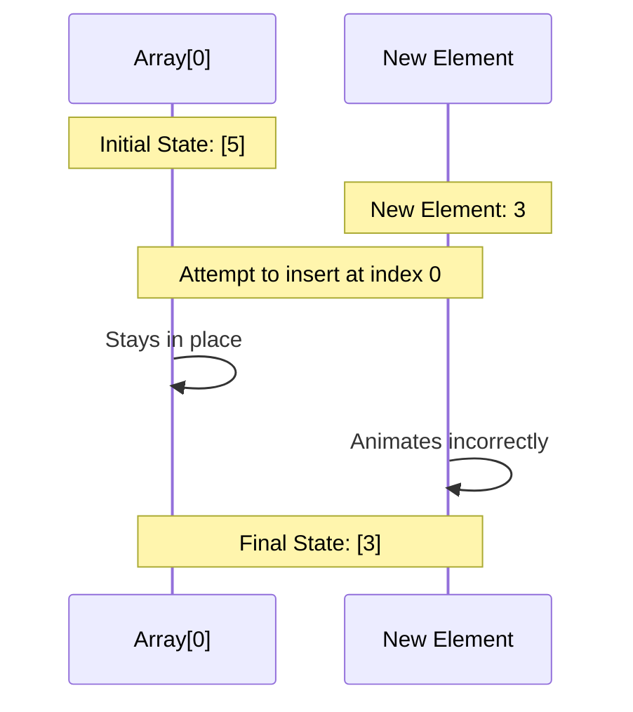
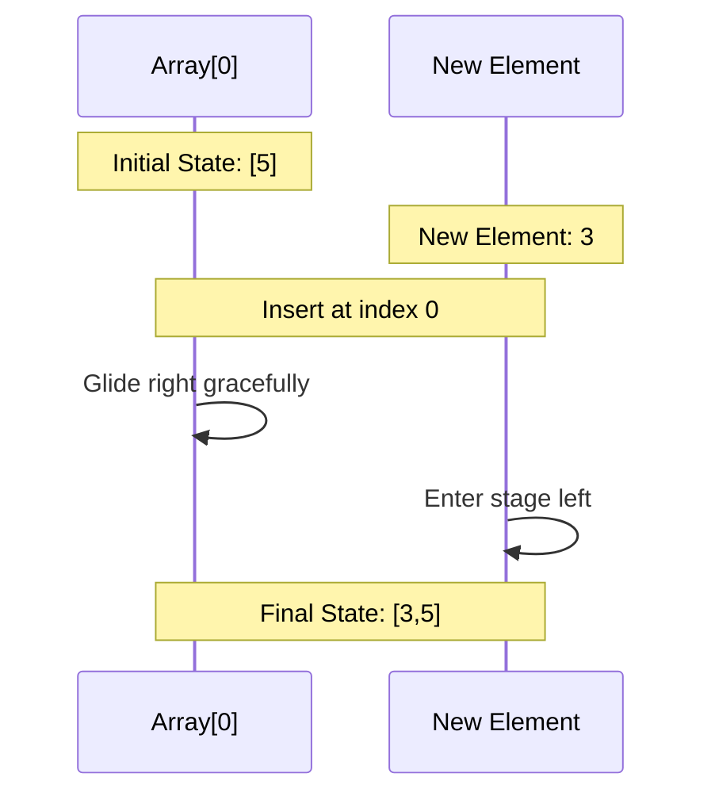

# 🎭 Array Animation Debugging Chronicle

*Hark! Here lies the tale of our array animation tribulations,
where elements dance not as they should, but as wayward spirits in the night.*

## 🎪 Act I: The Singular Element's Dilemma

### Scene I: The Current Tragedy


### Scene II: The Expected Performance


## 🎪 Act II: The Multiple Elements' Ballet

### Scene I: The Current Chaos
```mermaid
sequenceDiagram
    participant A1 as Array[0]
    participant A2 as Array[1]
    participant N as New Element
    
    Note over A1,A2: Initial State: [5,3]
    Note over N: New Element: 7
    Note over A1,A2,N: Insert at index 1
    A2->>A2: Stays still
    N->>N: Animates at wrong position
    Note over A1,A2,N: Incorrect Animation
```

### Scene II: The Desired Choreography
```mermaid
sequenceDiagram
    participant A1 as Array[0]
    participant A2 as Array[1]
    participant N as New Element
    
    Note over A1,A2: Initial State: [5,3]
    Note over N: New Element: 7
    Note over A1,A2,N: Insert at index 1
    A1->>A1: Holds position
    A2->>A2: Glides right
    N->>N: Enters at index 1
    Note over A1,A2,N: Final State: [5,7,3]
```

## 📜 The Bugs Most Foul

1. **The Singular Element's Curse**
   - *Current Behavior*: When inserting at index 0 with one element, the original element vanishes without animation
   - *Expected Behavior*: The original element should gracefully move right, making way for the new element
   - *Affected Files*:
     - `ArrayVisualizer.jsx`: Animation logic
     - `arrayVisualizerSlice.js`: State management
     - `basic_array_operations.js`: Core operations

2. **The Multiple Elements' Mishap**
   - *Current Behavior*: When inserting at index 1, the animation affects the wrong element
   - *Expected Behavior*: All elements from index 1 onward should move right in unison
   - *Affected Components*:
     - Element position calculations
     - Animation timing
     - State transitions

## 🔍 Investigation Points

1. **Animation State Management**
   ```javascript
   // Current State Flow
   setIsInserting(true) -> setElement -> setIndex -> animate -> setArray
   
   // Required State Flow
   setIsInserting(true) -> calculateNewPositions -> animateExistingElements 
   -> insertNewElement -> setArray -> setIsInserting(false)
   ```

2. **Position Calculation**
   ```javascript
   // Current Position Logic
   elementPosition = index * elementWidth
   
   // Required Position Logic
   elementPosition = shouldShift ? 
     (index + 1) * elementWidth : 
     index * elementWidth
   ```

3. **Animation Timing**
   ```javascript
   // Current Timing
   animate(newElement) -> updateArray
   
   // Required Timing
   animateExisting() -> wait -> insertNew() -> updateArray
   ```

## 🎯 Next Steps

1. **Act I Resolution**
   - Track element positions before and during animation
   - Ensure original element maintains presence during transition
   - Implement proper right-shift animation

2. **Act II Resolution**
   - Implement proper element position calculation
   - Add animation queue for synchronized movement
   - Fix state management during transitions

*Let us now proceed to examine each component in detail, 
and bring harmony to this algorithmic ballet.*
