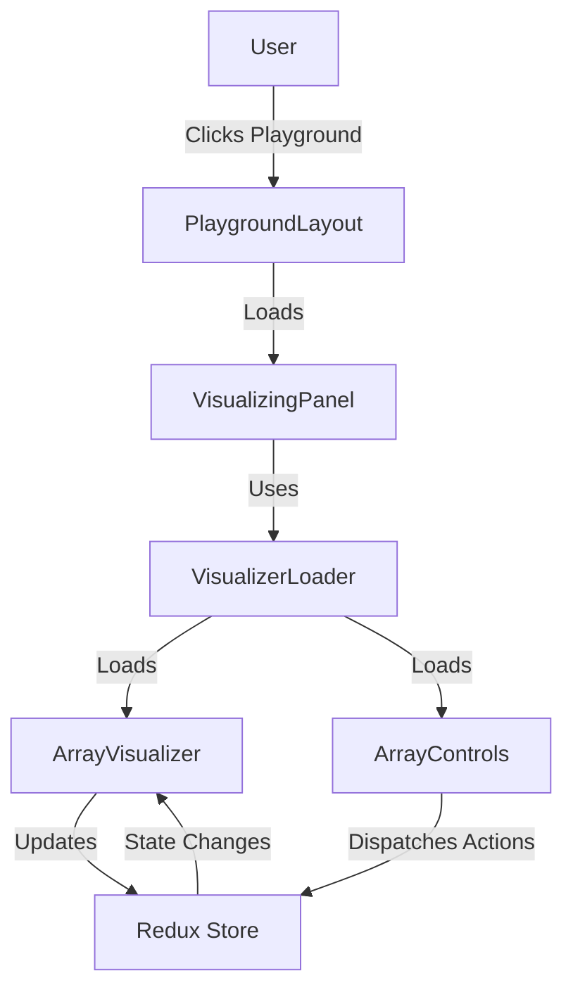
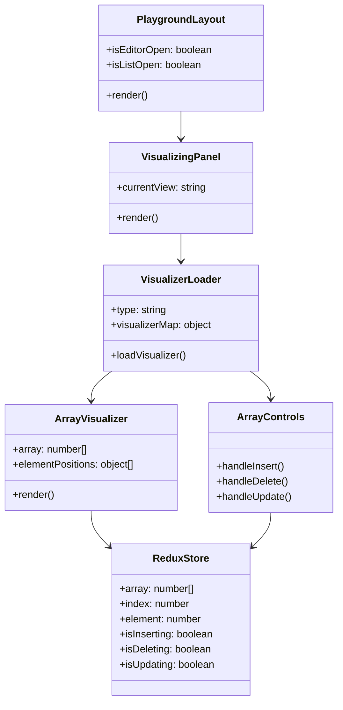
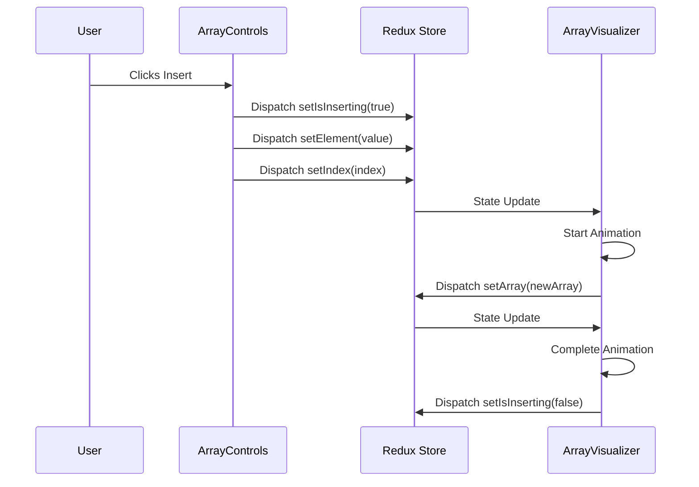
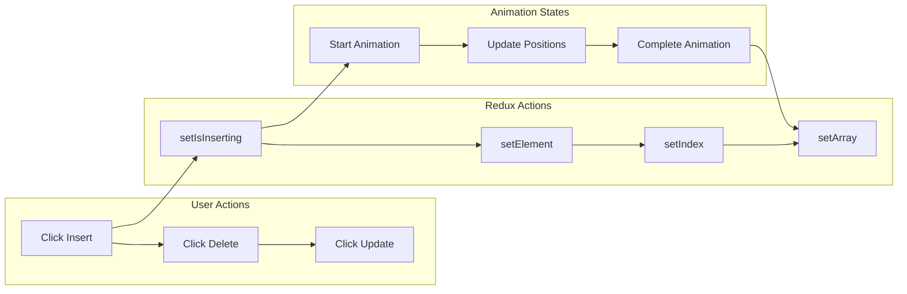
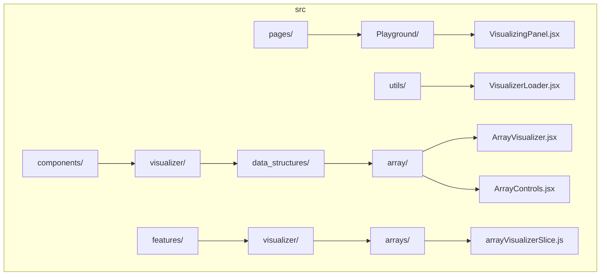
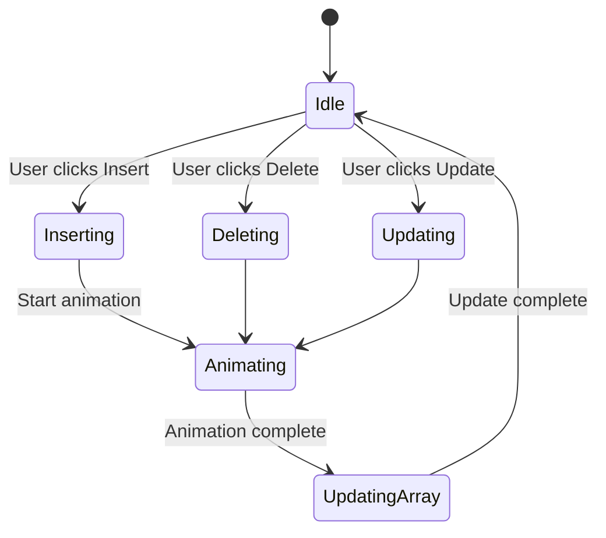

# 🎨 Data Structure & Algorithm Visualization Architecture

## 🔄 Flow Overview

## 🏗️ Component Architecture

## 🔄 State Management Flow

## 🎯 Array Operations Flow

## 📁 File Structure

## 🎨 Animation States

## 🔑 Key Points

1. **Component Hierarchy**
   - PlaygroundLayout is the top-level container
   - VisualizingPanel manages the current visualization
   - VisualizerLoader dynamically loads the appropriate components
   - ArrayVisualizer handles the actual visualization
   - ArrayControls provides user interaction

2. **State Management**
   - Redux store manages all state
   - Actions are dispatched from controls
   - Visualizer reacts to state changes
   - Animations are triggered by state updates

3. **Animation Flow**
   - Operation starts (insert/delete/update)
   - Animation begins
   - Array is updated
   - Animation completes
   - State is reset

4. **File Organization**
   - Clear separation of concerns
   - Components are modular
   - State management is centralized
   - Utils provide shared functionality
